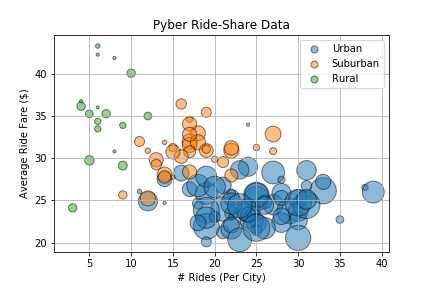
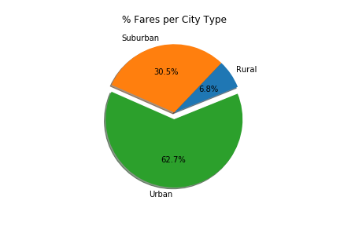
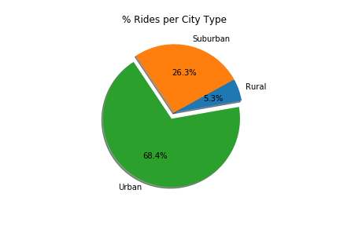
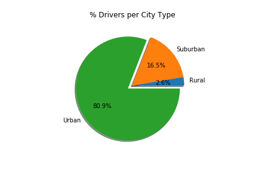

# Assignment Background: The Power of Plots

This assignment focuses on analyzing a fictional ride-sharing company's data using Python's Matplotlib library and Pandas dataframes. The following plots were used to come up with trends about the data, which I then reported as though I was reporting results back to the company.

## Ride Share Data

* Size relates to driver count per city

## Fare % by City Type

## Ride % by City Type

## Driver % by City Type

## Trends:

### 1 - Fare Breakdown
Our fares seem to have a negative relationship with our number of rides. This suggests that long distance trips (most of which are Urban as seen in our scatter plot) happen very infrequently. These Rural cities tend to have far fewer drivers than the average drivers for Urban and Suburban areas, but they also have far fewer rides than the other two as well. Urban riders tend to have the most drivers and riders, though the average fares tend to be smaller. Distance can be a factor in both of these cases, as some Rural drivers may traverse longer distances than Urban drivers. Shorter distances would cause smaller fares, and longer distances would cause larger fares.

### 2 - Our Demographic
When analyzing our data, we find that Urban areas make up a large majority of Pyber income, accounting for 62.7% of profits. Suburban (16.5%) and Rural (2.6%) account for far less, though it could be that those areas aren't as conducive to ride-sharing. It could be that the Rural areas are large farmlands or these areas tend to have a larger driving population than the Urban or Suburban areas, harkening back to the distance issue mentioned in the first point.

### 3 - Our Drivers and Riders
When thinking about how many rides we receive per city type, we also note that a majority of our drivers (80.9%) are in Urban areas as well. Naturally, more drivers means more rides per type (68.4%). With this in mind, it's no surprise that the sheer volume of rides in Urban areas, though they may be shorter with lower average fares, accounts for the greater total fare percentage.

## Copyright

Data Boot Camp © 2018. All Rights Reserved.
